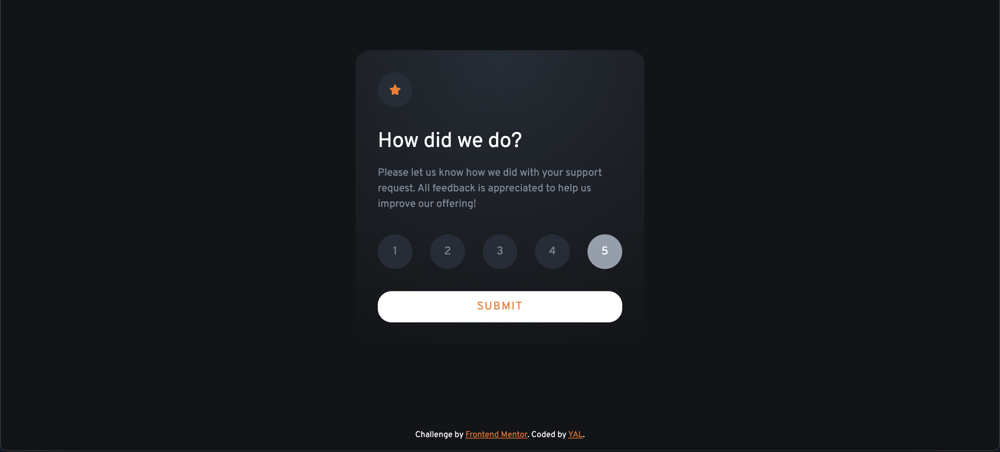

# Frontend Mentor - Interactive rating component solution
This is a solution to the [Interactive rating component challenge on Frontend Mentor](https://www.frontendmentor.io/challenges/interactive-rating-component-koxpeBUmI). Frontend Mentor challenges help you improve your coding skills by building realistic projects. 

## Table of contents
- [Overview](#overview)
  - [The challenge](#the-challenge)
  - [Screenshot](#screenshot)
  - [Links](#links)
- [My process](#my-process)
  - [Built with](#built-with)
  - [What I learned](#what-i-learned)
- [Author](#author)
- [Acknowledgments](#acknowledgments)

## Overview
### The challenge
Users should be able to:
- View the optimal layout for the app depending on their device's screen size
- See hover states for all interactive elements on the page
- Select and submit a number rating
- See the "Thank you" card state after submitting a rating

### Screenshot




### Links
- Live Site URL: https://yacodingroom.github.io/interactive-rating/

## My process
### Built with
- Semantic HTML5 markup
- CSS custom properties
- Flexbox
- jQuery

### What I learned
用了簡單的新增刪除class，讓評分按鈕不會同時被選取。

```html
<div class="rating-btn">
  <button class="score" value="1">1</button>
  <button class="score" value="2">2</button>
  <button class="score" value="3">3</button>
  <button class="score" value="4">4</button>
  <button class="score" value="5">5</button>
</div>
```
```css
.selected {
    background-color: hsl(217, 12%, 63%) !important;
    color: #fff !important;
}
```
```js
$(".score").click(function () {
    $(".score").removeClass("selected");
    $(this).addClass("selected");
    $("#score").text($(this).val());
})
```

## Author
- Frontend Mentor - [@YAcodingroom]
(https://www.frontendmentor.io/profile/YAcodingroom)
- Threads - [@nt19_lya](https://www.threads.net/@nt19_lya)

## Acknowledgments
感謝Ivy&Ciao，感謝Angela老師，感謝靜文老師，感謝Google，感謝Bootstrap，感謝宇宙，感謝自己。
